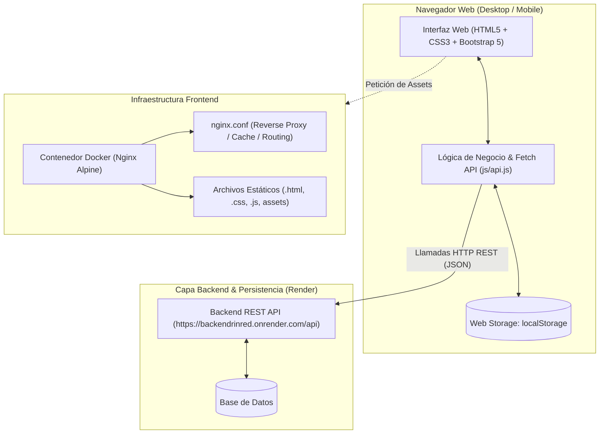
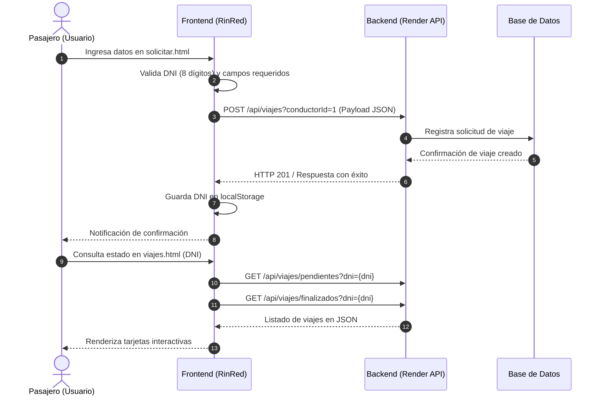

# 🚕 RinRed - Frontend (Explora Cusco)

[](https://developer.mozilla.org/es/docs/Web/HTML)
[](https://developer.mozilla.org/es/docs/Web/CSS)
[](https://developer.mozilla.org/es/docs/Web/JavaScript)
[](https://getbootstrap.com/)
[](https://www.docker.com/)
[](https://nginx.org/)
[](https://render.com/)

---

## 📌 1. Visión General del Proyecto

**RinRed (Explora Cusco)** es una aplicación web cliente moderna, ágil y totalmente responsiva diseñada para el servicio y gestión de transporte en taxi en la histórica ciudad de **Cusco, Perú**. 

La plataforma tiene como propósito conectar a pasajeros (turistas y residentes locales) con servicios de taxi seguros y confiables para traslados urbanos, circuitos turísticos (Centro Histórico, Sacsayhuamán, Valle Sagrado, estaciones hacia Machu Picchu) y traslados hacia/desde el Aeropuerto Internacional Alejandro Velasco Astete.

El sistema permite al usuario:
- Solicitar un taxi al instante proporcionando información básica de recojo y método de pago.
- Monitorear el estado de sus viajes (en transcurso o finalizados) a través de su número de identificación (DNI).
- Consultar los datos de seguridad y contacto del chofer asignado (nombre, teléfono, placa y color del vehículo).
- Cancelar viajes pendientes de forma inmediata con confirmación y brindar retroalimentación sobre los motivos de la cancelación.

---

## 🎯 2. En Qué Consiste

En el contexto del transporte público y turístico en Cusco, la seguridad, la trazabilidad y la previsibilidad son cruciales. **RinRed** resuelve la informalidad y la incertidumbre ofreciendo una experiencia digital transparente y directa sin requerir descargas pesadas de aplicaciones nativas: funciona directamente desde cualquier navegador web (móvil, tablet o escritorio).

### Propuesta de Valor
* **Acceso Inmediato:** Sin registros engorrosos; la trazabilidad y sesión se gestionan mediante el número de DNI y almacenamiento local (`localStorage`).
* **Seguridad Garantizada:** Visualización previa de los datos del conductor y placa del automóvil antes de abordar.
* **Flexibilidad de Pago:** Soporte para transacciones en efectivo, tarjetas bancarias y billeteras digitales ampliamente utilizadas en Perú (**Yape**).
* **Despliegue Ligero y Escalable:** Arquitectura contenerizada con Docker y Nginx que asegura altos estándares de rendimiento y bajo consumo de recursos.

---

## 🚀 3. Funcionalidades del Sistema

La solución está estructurada en módulos que cubren el ciclo de vida completo de un servicio de transporte:

```
[Inicio / Cobertura] ──► [Solicitar Taxi] ──► [Monitoreo "Mis Viajes"] ──► [Detalle Conductor]
                                      │                                 │
                                      └────────► [Cancelación] ◄────────┘
```

### 3.1. Portal de Bienvenida y Cobertura (`index.html`)
* **Carrusel Visual:** Sliders con imágenes representativas de Cusco y llamadas a la acción (*Call to Action*).
* **Navegación Rápida:** Acceso con un clic para solicitar un vehículo o consultar viajes activos.
* **Mapa de Cobertura Dinámico:** Integración de Google Maps centrado en la Plaza de Armas del Cusco, delimitando el área de operación urbana y periférica.
* **Sección Informativa:** Preguntas frecuentes (FAQ), canales de soporte telefónico, correo institucional y redes sociales.

### 3.2. Solicitud y Registro de Carrera (`solicitar.html`)
* **Formulario de Recojo:** Captura de datos esenciales:
  * Número de DNI (con validación de formato numérico de 8 dígitos).
  * Nombre del solicitante.
  * Teléfono de contacto.
  * Dirección actual de recogida.
  * Selección del método de pago (*Efectivo*, *Yape*, *Tarjeta*).
* **Asignación y Envío:** Envío asíncrono (`POST`) al backend para el registro del viaje con conductor asignado.
* **Persistencia Local:** Almacenamiento automático del DNI en `localStorage` (`dniUsuario`) para agilizar futuras consultas.

### 3.3. Gestión y Consulta de Viajes (`viajes.html`)
* **Búsqueda por DNI:** Permite ingresar el documento de identidad para consultar el historial en tiempo real.
* **Categorización de Servicios:**
  * **Viajes en transcurso (Pendientes):** Muestra el destino, datos del chofer, botón de acceso al perfil del conductor y acción para cancelar la carrera.
  * **Viajes Finalizados:** Historial con insignia de estado completado.
* **Cancelación Asíncrona:** Flujo seguro de cancelación con diálogo de confirmación, indicador de carga (*spinner*) y eliminación animada del DOM tras llamar al endpoint `DELETE`.

### 3.4. Ficha Técnica del Conductor (`info.html`)
* **Parámetro Dinámico por URL:** Obtiene el `conductorId` desde los parámetros de búsqueda (`?conductorId=...`).
* **Tarjeta de Confianza:** Muestra la fotografía del conductor, calificación promedio en estrellas (★ ★ ★ ★ ★), nombre completo, número de contacto, número de placa del vehículo y color del automóvil para rápida identificación en calle.

### 3.5. Encuesta de Cancelación (`cancelacion.html`)
* **Fondo Multimedia Dinámico:** Video en segundo plano (`video/video.mp4`) que enriquece la interfaz de usuario.
* **Feedback y Métrica de Calidad:** Formulario interactivo con casillas de verificación para registrar motivos de cancelación (cambio de planes, salud, costo, tiempo de espera, problemas técnicos) y campo abierto para sugerencias.

---

## 🏗️ 4. Arquitectura del Proyecto

El proyecto adopta un patrón arquitectónico **Cliente-Servidor desacoplado** (Decoupled Client-Server Architecture), separando el frontend estático del backend de servicios RESTful.

### 4.1. Diagrama de Arquitectura Global



### 4.2. Flujo de Datos y Consumo de la API



---

## 📡 5. Integración con la API REST

El frontend se comunica con el backend alojado en **Render Cloud**:
- **URL Base:** `https://backendrinred.onrender.com/api`
- **Archivo Centralizador:** `js/api.js`

### Catálogo de Endpoints Consumidos

| Método | Endpoint | Parámetros / Query | Descripción |
| :--- | :--- | :--- | :--- |
| `POST` | `/viajes` | `conductorId` (Query) + Body JSON | Crea una nueva solicitud de viaje para un conductor asignado. |
| `GET` | `/viajes/pendientes` | `dni` (Query) | Retorna la lista de viajes en curso asociados al DNI del pasajero. |
| `GET` | `/viajes/finalizados` | `dni` (Query) | Retorna la lista de viajes concluidos asociados al DNI del pasajero. |
| `DELETE` | `/viajes/{id}` | `id` (Path) | Cancela y elimina un viaje pendiente del sistema. |
| `GET` | `/conductores/{id}` | `id` (Path) | Obtiene los detalles públicos del conductor y su vehículo. |

#### Estructura de Payload para Solicitud de Viaje (`POST /viajes`):
```json
{
  "dni": "12345678",
  "nombre": "Juan Pérez",
  "telefono": "984123456",
  "direccionActual": "Av. El Sol 450, Cusco",
  "formaPago": "efectivo"
}
```

---

## 📁 6. Estructura de Directorios

```plaintext
rin_front-main/
├── .dockerignore           # Archivos omitidos en la compilación de la imagen Docker
├── .gitignore              # Archivos y carpetas ignorados por el control de versiones Git
├── Dockerfile              # Definición de contenedor basada en nginx:alpine
├── nginx.conf              # Configuración de Nginx con fallback de SPA y políticas de caché
├── README.md               # Documentación general y técnica del proyecto
│
├── index.html              # Landing page principal con carrusel, enlaces y mapa de cobertura
├── solicitar.html          # Formulario de solicitud de servicio de taxi
├── viajes.html             # Panel de consulta, estado y cancelación de carreras
├── info.html               # Ficha detallada del conductor y vehículo asignado
├── cancelacion.html        # Formulario de feedback y encuesta de cancelación con video
│
├── css/                    # Hojas de estilo modulares
│   ├── index.css           # Estilos específicos para la landing page
│   ├── style.css           # Estilos para el formulario de solicitud
│   ├── viajes.css          # Estilos para las tarjetas y listado de viajes
│   ├── info.css            # Estilos para la vista de detalle del chofer
│   └── cancelacion.css     # Estilos y superposiciones para la pantalla de cancelación
│
├── js/                     # Lógica JavaScript cliente
│   └── api.js              # Funciones asíncronas de integración con la API REST
│
├── img/                    # Recursos gráficos (logos, fotos de destinos, vehículos, etc.)
│   ├── logo.png
│   ├── jacinta.png
│   ├── img1.jpeg
│   ├── img2.png
│   ├── slider2.jpeg
│   └── ...
│
└── video/                  # Recursos multimedia
    └── video.mp4           # Video de fondo para la sección de cancelación
```

---

## ⚙️ 7. Instalación y Ejecución

### Requisitos Previos
* Para ejecución local simple: Cualquier navegador moderno (Chrome, Firefox, Edge, Safari).
* Para ejecución con contenedor: [Docker](https://www.docker.com/) instalado en el sistema.

### Opción 1: Ejecución Local Rápida (Sin Docker)
1. Clona el repositorio:
   ```bash
   git clone https://github.com/JorgeRuiz20/FrontendRinRed.git
   cd FrontendRinRed
   ```
2. Inicia un servidor HTTP local o abre directamente el archivo `index.html` en tu navegador.
   * Usando la extensión **Live Server** de Visual Studio Code (Recomendado).
   * O mediante Python:
     ```bash
     # Python 3
     python -m http.server 8080
     ```
   * Abre `http://localhost:8080` en tu navegador.

### Opción 2: Ejecución con Docker (Producción / Contenedor)
El proyecto incluye un `Dockerfile` optimizado y un archivo de configuración para **Nginx**:

1. **Construir la imagen de Docker:**
   ```bash
   docker build -t rinred-frontend:latest .
   ```

2. **Ejecutar el contenedor:**
   ```bash
   docker run -d -p 80:80 --name rinred-app rinred-frontend:latest
   ```

3. Accede a `http://localhost` desde tu navegador.

---

## 🛠️ 8. Configuración del Servidor Web (Nginx)

El archivo `nginx.conf` implementa las mejores prácticas para sitios web modernos:
- **Redirección de Rutas:** Emplea `try_files $uri $uri/ /index.html;` para soportar navegación fluida sin caídas 404.
- **Caché Eficiente de Assets:** Configuración de expiración a 7 días (`expires 7d;`) y cabecera `Cache-Control: public, no-transform;` para imágenes (`jpg, png, gif, ico`), estilos (`css`), scripts (`js`) y video (`mp4`).
- **Páginas de Error Estándar:** Manejo de códigos 500, 502, 503 y 504 redirigiendo a plantillas de contingencia.

---

## 👥 9. Autores y Contribuciones

* **Desarrollo y Mantenimiento:** Jorge Ruiz ([@JorgeRuiz20](https://github.com/JorgeRuiz20))
* **Propósito:** Proyecto de Sistema de Transporte Urbano y Turístico para Cusco - RinRed.
